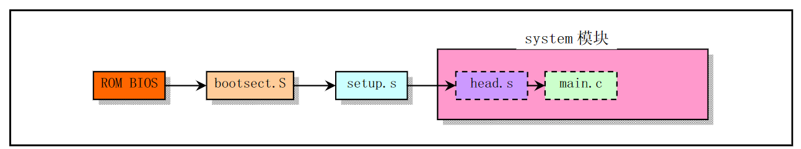

# boot

### 从系统加电执行顺序

### 启动盘引导路线图

### [bootsect.s](bootsect.s.md)

**引导扇区**代码，`bootsect.s`会被**bios**启动进程加载到**0x7c00**，然后会将**bootsect**移动到**0x90000**，将**setup.s**加载到**0x90200**，将**system**加载到**0x10000**，并跳转到**0x90000**位置。

